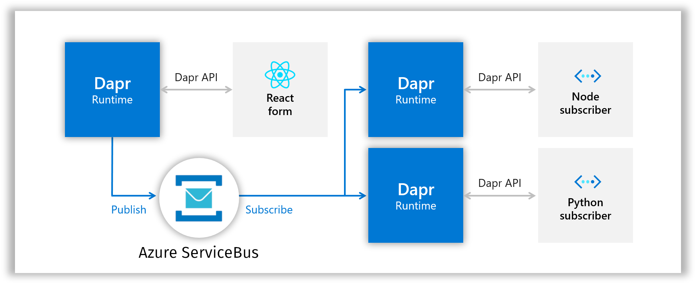
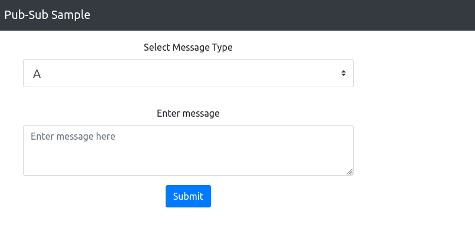

# Pub-Sub using Dapr with Azure Container Apps and Service Bus

> Learning Azure Container Apps

- 📂 This repo contains code to deploy the [Dapr pub-sub application](https://github.com/dapr/quickstarts/tree/master/tutorials/pub-sub) on [Azure Container Apps](https://docs.microsoft.com/en-us/azure/container-apps/overview) using [Azure Service Bus](https://docs.microsoft.com/en-us/azure/service-bus-messaging/service-bus-messaging-overview) for handling publisher and subscriber (Pub-Sub) functionality. 

- 💻 The application consists of a React web frontend, a Python subscriber component and a Node subscriber component.

- :tophat: Since we use [Dapr](https://dapr.io) we can replace Redis (as used in the [application quickstart](https://github.com/dapr/quickstarts/tree/master/tutorials/pub-sub)) with Azure Service Bus without _any_ changes to the application code. In fact, we change both the environment the apps run in from local containers or Kubernetes to Azure Container Apps _and_ the message broker without modifying the applications themselves! _Portable microservices_ FTW!

### Tools

- :hammer: Azure PowerShell for deployment
- :muscle: Bicep for Infrastructure as Code

### Overview


([modified diagram, original by Dapr](https://github.com/dapr/quickstarts/blob/master/tutorials/pub-sub/img/Local_Architecture_Diagram.png) - [Apache 2.0](https://github.com/dapr/quickstarts/blob/master/LICENSE))

## Usage

### Prerequisites

1. Contributor (or higher) permissions on an Azure subscription
2. [Install/update Azure PowerShell module](https://docs.microsoft.com/en-us/powershell/azure/install-az-ps?view=latest)
3. [Install/update Bicep CLI](https://docs.microsoft.com/en-us/azure/azure-resource-manager/bicep/install#install-manually=)
4. Connect to Azure: `Connect-AzAccount`
5. Set Context: `Set-AzContext -SubscriptionName <subscription name>`
6. Register resource provider: `Register-AzResourceProvider -ProviderNamespace Microsoft.App`

### Deploy

Open PowerShell and run [deploy.ps1](./deploy.ps1) to deploy the resources:

```powershell
./deploy.ps1

# Example output
🚀 Deploying container apps...(this will take a few minutes)

✔️  Deploy succeeded! React frontend url:
https://react-form.<unique name>.canadacentral.azurecontainerapps.io/order
```

### Send a publisher message

1. Open the React frontend url from the deployment output:



2. Choose a message type and enter your custom message, and press **Submit**

Example publisher messages:

```bash
A: Hello world to all my subscribers!     # this topic will be received by all
B: Hello world to some of my subscribers! # this topic will only be received by node-subscriber
C: Hello to my C-topic fans!              # this topic will only be received by python-subscriber
```

### Verify messages in subscribers


1. View logs from both subscriber services:

```powershell
$LOG_ANALYTICS_WORKSPACE_CLIENT_ID = (Get-AzOperationalInsightsWorkspace -ResourceGroupName dapr-pubsub-containerapps-demo).CustomerId.Guid
$query = "
ContainerAppConsoleLogs_CL
| where ContainerAppName_s hassuffix_cs  '-subscriber'
| where ContainerName_s hassuffix_cs '-subscriber'
| where Stream_s  == 'stdout'
| project ContainerName_s, Log_s, TimeGenerated
| sort by TimeGenerated desc
| take 6
"
$queryResults = Invoke-AzOperationalInsightsQuery -WorkspaceId $LOG_ANALYTICS_WORKSPACE_CLIENT_ID -Query $query -TimeSpan (New-Timespan -Hours 1)
Write-Host "$($queryResults.Results | ConvertTo-Json)"
```

Example output:

```json
[
  {
    "ContainerName_s": "python-subscriber",
    "Log_s": "Received message \"Hello to my C-topic fans!\" on topic \"C\"",
    "TimeGenerated": "2022-05-24T21:39:31.287Z"
  },
  {
    "ContainerName_s": "python-subscriber",
    "Log_s": "C: {'datacontenttype': 'application/json', 'source': 'react-form', 'type': 'com.dapr.event.sent', 'traceid': '00-eafc38d79174ab05699909ef2ef43051-e2ccdc2b04447cd5-01', 'tracestate': '', 'data': {'messageType': 'C', 'message': 'Hello to my C-topic fans!'}, 'id': '59d412c7-2bce-416b-972d-8d3237e02cd5', 'specversion': '1.0', 'topic': 'C', 'pubsubname': 'pubsub', 'traceparent': '00-eafc38d79174ab05699909ef2ef43051-e2ccdc2b04447cd5-01'}",
    "TimeGenerated": "2022-05-24T21:39:31.287Z"
  },
  {
    "ContainerName_s": "node-subscriber",
    "Log_s": "B:  Hello world to some of my subscribers!",
    "TimeGenerated": "2022-05-24T21:39:01.737Z"
  },
  {
    "ContainerName_s": "python-subscriber",
    "Log_s": "Received message \"Hello world to all my subscribers!\" on topic \"A\"",
    "TimeGenerated": "2022-05-24T21:38:41.18Z"
  },
  {
    "ContainerName_s": "python-subscriber",
    "Log_s": "A: {'traceparent': '00-1d2dd1e66c9f1c9491cf2ef316b6d15c-14c080f90a881d07-01', 'tracestate': '', 'datacontenttype': 'application/json', 'topic': 'A', 'pubsubname': 'pubsub', 'traceid': '00-1d2dd1e66c9f1c9491cf2ef316b6d15c-14c080f90a881d07-01', 'data': {'messageType': 'A', 'message': 'Hello world to all my subscribers!'}, 'id': '231c85e2-565e-4d93-b96f-7dbab41f6ab1', 'specversion': '1.0', 'source': 'react-form', 'type': 'com.dapr.event.sent'}",
    "TimeGenerated": "2022-05-24T21:38:41.18Z"
  },
  {
    "ContainerName_s": "node-subscriber",
    "Log_s": "A:  Hello world to all my subscribers!",
    "TimeGenerated": "2022-05-24T21:38:41.12Z"
  }
]
```

:heavy_check_mark: As noted the messages on topic A is received by both the node and python-subscriber, while B is only received by the node-subscriber and C is only received by the python-subscriber. All without any direct coupling between the publisher service and the subscriber services! Loosely coupled? ;)

This is a _very simple_ explanation of how [Service Bus topics works](https://docs.microsoft.com/en-us/azure/service-bus-messaging/service-bus-messaging-overview#topics), but feel free to read more about [architectural considerations around Pub-Sub architecture](https://docs.microsoft.com/en-us/azure/architecture/patterns/publisher-subscriber)!


## Clean up resources

The deployed resources will not incur large costs, but to clean everything up run the following command:

```powershell
Remove-AzResourceGroup -Name dapr-pubsub-containerapps-demo -Force
```

## License

[Apache License 2.0](LICENSE)